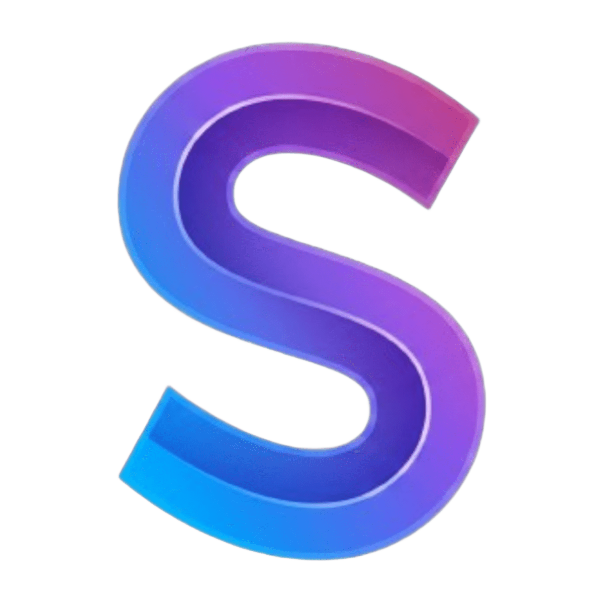
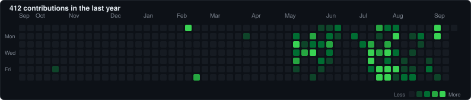

<!-- HERO BANNER -->

 

<!-- TYPEWRITER -->

  

<!-- SOCIALS -->

  
  
  
  
  

---

### About Me
I'm **INXRT** — music producer (Phonk, Brazilian Funk, Hardtekk) and full-stack web developer building platforms, portals, and tools.

- 🎧 **Music**: Producing underground phonk and high-energy electronic tracks (*E R O S I O N*, *W I N T E R*, *MONTAGEM TERREMOTO*).
- 💻 **Dev**: Building web applications with Next.js, React, Tailwind, and cloud infrastructure.
- 💬 **Discord**: Best place to reach me — `INXRT` ([Click here to connect](https://discord.com/users/770669145854967836)).

---

### Projects & Platforms

<table>
  <thead>
    <tr>
      <th width="24%">Project</th>
      <th width="50%">Description</th>
      <th width="26%">Links</th>
    </tr>
  </thead>
  <tbody>
    <tr>
      <td align="center">
         
        <strong>The Signal</strong> 
        Music Distribution
      </td>
      <td>Enterprise music distribution and label management portal with automated ISRC/UPC ingestion, sublabel management, and contract tracking.</td>
      <td>
         
        
      </td>
    </tr>
    <tr>
      <td align="center">
         
        <strong>Villain Arc Records</strong> 
        Electronic Record Label
      </td>
      <td>Underground electronic music label website for Hardstyle & Hardtekk releases with Spotify playlist vaults and catalog streaming.</td>
      <td>
         
        
      </td>
    </tr>
    <tr>
      <td align="center">
         
        <strong>Grozik Media</strong> 
        Marketing Agency & Label
      </td>
      <td>Music marketing agency and record label website built with smooth inertial scrolling (Lenis/GSAP), viral campaigns, and artist rollouts.</td>
      <td>
         
        
      </td>
    </tr>
    <tr>
      <td align="center">
         
        <strong>STEMIC</strong> 
        Audio Marketplace
      </td>
      <td>Audio sample pack marketplace featuring a 0% platform fee seller tier, community track feedback credits, and audio watermarking.</td>
      <td>
         
        
      </td>
    </tr>
    <tr>
      <td align="center">
         
        <strong>AuraPod</strong> 
        RF & Caching Hub
      </td>
      <td>Portable RF signal concentrator and campus caching hub engineered for low-connectivity academic environments.</td>
      <td>
         
        
      </td>
    </tr>
    <tr>
      <td align="center">
         
        <strong>PokeQuest</strong> 
        Gamified Productivity
      </td>
      <td>Gamified productivity web app turning real-life tasks and to-dos into XP, coins, and Pokémon companion leveling.</td>
      <td>
         
        
      </td>
    </tr>
    <tr>
      <td align="center" colspan="3">
        <em>...and many more. <a href="https://github.com/INXRT?tab=repositories">View all repositories →</a></em>
      </td>
    </tr>
  </tbody>
</table>

---

### Music & Releases

  

    
  

- **Genres**: Brazilian Phonk, Funk Automotivo, Hardtekk, Electronic
- **Releases**: *E R O S I O N*, *W I N T E R*, *MONTAGEM TERREMOTO*
- **Tools**: FL Studio, custom distortion racks, FFmpeg

---

### Tech Stack

  

    
  

<strong>🔍 Full Stack Breakdown</strong>

 

| Category | Technologies |
| :--- | :--- |
| **Languages** | TypeScript, JavaScript, Python, C++, HTML5, CSS3 |
| **Frontend** | Next.js, React, Vite, Tailwind CSS v4, Framer Motion, GSAP, Lenis |
| **Cloud & Backend** | Node.js, Express, AWS S3, Google Cloud Run, Firebase, Cloudflare, PostgreSQL, Vercel |
| **Tools** | Docker, Git, GitHub Actions, Sentry, FFmpeg, FL Studio |

---

### GitHub Stats

  <!-- CONTRIBUTION HEATMAP (SHOWING ALL 394 CONTRIBUTIONS) -->
  

    

  <!-- METRICS & STREAK -->
  

    
    
    
  

  
  

---

  

