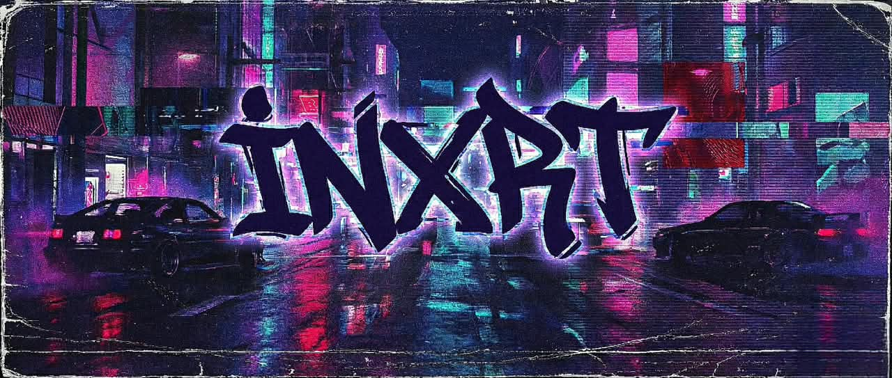

<div align="center">

<!-- HERO CUSTOM BANNER -->


<br/>

<!-- DYNAMIC TYPEWRITER TERMINAL -->
<p align="center">
  
</p>

<!-- SOCIAL COMMAND CENTER -->
<p align="center">
  <a href="https://discord.com/users/770669145854967836" target="_blank">
    
  </a>
  <a href="https://open.spotify.com/artist/53iSSz8h8DCG0blxwCFtrV" target="_blank">
    
  </a>
  <a href="https://instagram.com/inxrtmusic" target="_blank">
    
  </a>
  <a href="https://youtube.com/@UCNFpmDje__GbhrtOpICv1Ig" target="_blank">
    
  </a>
  <a href="mailto:inxrtmusic@gmail.com">
    
  </a>
</p>

</div>

---

### ⚡ Transmission // About Me
```text
┌─── IDENTITY ──────────────────────────────────────────────────────────────┐
│  • Moniker     : INXRT                                                    │
│  • Disciplines : Phonk / Funk Producer • Full-Stack Web Engineer          │
│  • Vibe        : Dark Cyberpunk • High-Adrenaline Club Sound • Fluid UI   │
│  • Comms       : Discord : INXRT             │
└───────────────────────────────────────────────────────────────────────────┘
```
> Multigenre music producer crafting raw Brazilian Phonk, Funk Automotivo, and Hardtekk basslines by night; engineering high-performance web applications, digital label ecosystems, and media distribution platforms by day.

---

### 🚀 Production Platforms & Live Deployments

<table>
  <thead>
    <tr>
      <th width="28%">Platform</th>
      <th width="44%">Architecture & Mission</th>
      <th width="28%">Access Points</th>
    </tr>
  </thead>
  <tbody>
    <tr>
      <td>
        <strong>⚡ The Signal</strong><br/>
        <sub>Enterprise Music Distribution</sub>
      </td>
      <td>High-end music distribution portal, automated ISRC/UPC ingestion, sublabel approval flow, split-sheet ledger, and recoupment management.</td>
      <td>
        <a href="https://distro.thesignalent.com/" target="_blank">
          
        </a><br/>
        <a href="https://github.com/INXRT/TheSIGNAL">
          
        </a>
      </td>
    </tr>
    <tr>
      <td>
        <strong>🔥 Villain Arc Records</strong><br/>
        <sub>Underground Electronic Label</sub>
      </td>
      <td>Independent electronic record label portal celebrating raw sound intensity, dark cyberpunk aesthetics, Hardstyle, Hardtekk, and curated Spotify vaults.</td>
      <td>
        <a href="https://villainarcrecords.com/" target="_blank">
          
        </a><br/>
        <a href="https://github.com/INXRT/VillainArcRecords">
          
        </a>
      </td>
    </tr>
    <tr>
      <td>
        <strong>⚡ Grozik Media</strong><br/>
        <sub>Music Marketing Agency & Record Label</sub>
      </td>
      <td>Viral TikTok campaign strategy, influencer networks, artist rollouts, and kinetic dark-mode UI with Lenis inertial smooth scrolling and GSAP timelines.</td>
      <td>
        <a href="https://grozik.media/" target="_blank">
          
        </a><br/>
        <a href="https://github.com/INXRT/GrozikMedia">
          
        </a>
      </td>
    </tr>
    <tr>
      <td>
        <strong>🧬 STEMIC</strong><br/>
        <sub>Next-Gen Audio Marketplace</sub>
      </td>
      <td>0% fee Pro Seller tier ("Keep 100%"), Community Feedback Credit economy, automated 3D pack box generator, and anti-piracy audio watermarking.</td>
      <td>
        <a href="https://stemic.org/" target="_blank">
          
        </a><br/>
        <a href="https://github.com/INXRT/StemicWEB">
          
        </a>
      </td>
    </tr>
    <tr>
      <td>
        <strong>📡 AuraPod</strong><br/>
        <sub>Portable RF & Caching Hub</sub>
      </td>
      <td>Resilient campus caching node and RF signal concentrator engineered to maintain flow in low-connectivity academic zones.</td>
      <td>
        <a href="https://aurapod.pages.dev/" target="_blank">
          
        </a><br/>
        <a href="https://github.com/INXRT/AuraPod">
          
        </a>
      </td>
    </tr>
    <tr>
      <td>
        <strong>🎮 PokeQuest</strong><br/>
        <sub>Gamified Productivity</sub>
      </td>
      <td>Gamified productivity ecosystem turning daily task execution into XP, coin rewards, and companion Pokémon leveling.</td>
      <td>
        <a href="https://pokequestweb.vercel.app" target="_blank">
          
        </a><br/>
        <a href="https://github.com/INXRT/PokeQuest">
          
        </a>
      </td>
    </tr>
    <tr>
      <td>
        <strong>⚡ The Lab & Beyond</strong><br/>
        <sub>R&D • Incubating Engines</sub>
      </td>
      <td>
        <em>Constantly architecting new web engines, music tech tools, AI audio pipelines, and private SaaS portals. More showcase clones deployed as builds reach production.</em>
      </td>
      <td>
        <a href="https://github.com/INXRT?tab=repositories">
          
        </a><br/>
        
      </td>
    </tr>
  </tbody>
</table>

<p align="center">
  <em>⚡ <strong>Active Radar:</strong> Multiple confidential web platforms, audio DSP tools, and AI engines are currently in private staging.<br/>
  As projects stabilize, public display clones are published directly to <a href="https://github.com/INXRT?tab=repositories"><strong>@INXRT repositories</strong></a>.</em>
</p>

---

### 🎛️ Sound Architecture & Discography

<div align="center">
  <p>
    <a href="https://open.spotify.com/artist/53iSSz8h8DCG0blxwCFtrV" target="_blank">
      
    </a>
  </p>
</div>

- **Sonic Signature**: Brazilian Phonk, Funk Automotivo, Hardtekk, Industrial Club Phonk, Heavy Sub-Bass
- **Catalog Releases**: *E R O S I O N* • *W I N T E R* • *MONTAGEM TERREMOTO*
- **Production Toolset**: FL Studio, Custom Saturation Racks, Modular Distortion, FFmpeg Transcoding Pipeline

---

### 🛠️ Weapon of Choice // Engineering Arsenal

<div align="center">
  <p>
    
  </p>
</div>

<details>
<summary><strong>🔍 Click to inspect complete categorized stack</strong></summary>
<br/>

| Tier | Technologies & Protocols |
| :--- | :--- |
| **Languages & Core** | TypeScript, JavaScript (ESNext), Python 3.11+, C++, HTML5, CSS3 |
| **Frontend Frameworks** | Next.js (App Router, Server Components), React 18, Vite |
| **Motion & Physics** | Framer Motion, GSAP (GreenSock), Lenis Smooth Inertial Scrolling, Anime.js |
| **Styling & Design** | Tailwind CSS v4, Custom Dark Glassmorphism, Responsive Grid Systems |
| **Cloud & Storage** | AWS S3 (Presigned URLs), Google Cloud Run, Google Cloud Storage, Firebase |
| **Edge & Security** | Cloudflare Edge DNS, Cloudflare Turnstile Bot Defense, Sentry Telemetry |
| **Database & DevOps** | PostgreSQL, Cloud Firestore, Docker, GitHub Actions, Vercel Production |

</details>

---

### 📊 Telemetry & Live GitHub Analytics

<div align="center">
  
  
</div>

<div align="center">
  <br/>
  
</div>

---

<div align="center">
  <p><sub>ENGINEERED BY INXRT • BUILT ON SOUND & CODE</sub></p>
  
</div>
